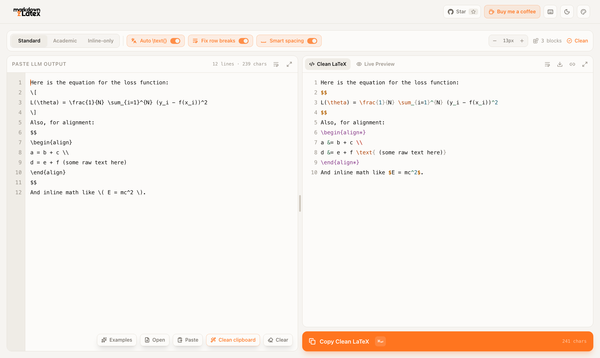

<div align="center">

<picture>
  <source media="(prefers-color-scheme: dark)" srcset="static/logo-dark.png">
  
</picture>

### Paste messy LLM math. Get LaTeX that compiles on the first try.

<a href="https://github.com/donghyuklee1/markdown2latex/actions/workflows/ci.yml"></a>
<a href="LICENSE"></a>
<a href="package.json"></a>
<a href="https://github.com/sponsors/donghyuklee1"></a>

<a href="#quickstart"><b>Quickstart</b></a>
&nbsp;&middot;&nbsp;
<a href="#what-it-fixes"><b>What it fixes</b></a>
&nbsp;&middot;&nbsp;
<a href="#keyboard-shortcuts"><b>Shortcuts</b></a>
&nbsp;&middot;&nbsp;
<a href="examples/"><b>Examples</b></a>
&nbsp;&middot;&nbsp;
<a href="docs/ENGINE.md"><b>How it works</b></a>

<br/>

<picture>
  <source media="(prefers-color-scheme: dark)" srcset="static/readme/screenshot-dark.png">
  
</picture>

</div>

<br/>

ChatGPT, Claude and DeepSeek all write LaTeX, and all of them write it slightly
wrong: `\[...\]` where your editor wants `$$`, an `align` block uselessly wrapped
in `$$`, a missing `\\` at the end of a row, prose sitting bare inside the maths,
`\int f(x) dx` with no thin space, and a zero-width space you cannot see but
`pdflatex` can.

This tool fixes all of that in one paste, live, as you type - entirely in your
browser.

<table>
<tr>
<th width="50%">Pasted from an LLM</th>
<th width="50%">What you copy out</th>
</tr>
<tr>
<td valign="top">

```latex
Here is the loss:
\[
L(\theta) = \frac{1}{N} \sum_{i=1}^{N} (y_i - f(x_i))^2
\]
For alignment:
$$
\begin{align}
a = b + c \\
d = e + f (some raw text here)
\end{align}
$$
And \( \int_0^1 sin x dx \).
```

</td>
<td valign="top">

```latex
Here is the loss:
$$
L(\theta) = \frac{1}{N} \sum_{i=1}^{N} (y_i - f(x_i))^2
$$
For alignment:
\begin{align*}
a &= b + c \\
d &= e + f \text{ (some raw text here)}
\end{align*}
And $\int_0^1 \sin x\,dx$.
```

</td>
</tr>
</table>

The `$$` around the `align` is **gone** (a hard Overleaf error), the `align` is
**starred** so it will not renumber your paper, the rows grew their missing `&`
and `\text{}`, `sin` became an upright `\sin`, and the integral got its `\,dx`.
More before/after pairs, in all three delimiter modes: [`examples/`](examples/).

## A whole paper, live

Paste an entire `.tex` report - or pick **Examples -> Research report** - and the
**Live Preview** typesets it the way Overleaf's PDF would, as you type:

- your preamble's `\newcommand` / `\DeclareMathOperator` macros just work;
- sections, equations and every `align` row are numbered; `\ref`, `\eqref` and
  `\cite` resolve (`Theorem 2.2`, `(4)`, `[1]`), and a missing label shows as
  a red **??** before you ever compile;
- `\newtheorem` environments, proofs, booktabs tables, figures, lists, footnotes
  and the bibliography all render;
- hover a reference to see its target, double-click anything to jump to its
  source, switch to two columns, or **Save as PDF**.

The full report used in the screenshot is
[`examples/06-report.md`](examples/06-report.md) - 124 lines of LaTeX with five
custom macros, four numbered equations, a theorem, a definition, a lemma, a
proof, a results table, a figure and a bibliography.

## Quickstart

```bash
git clone https://github.com/donghyuklee1/markdown2latex.git
cd markdown2latex
npm install
npm run dev        # http://localhost:3000
```

Node 20.9+ (22 recommended). The editor opens pre-filled with a messy LLM
answer, so you can see what it does before typing anything.

## What it fixes

<table>
<tr><th>Area</th><th>In the LLM's output</th><th>What you get</th></tr>
<tr><td rowspan="3"><b>Delimiters</b></td>
  <td><code>\[ ... \]</code>, <code>\( ... \)</code></td><td>Your chosen style: <code>$$</code> / <code>$</code>, <code>equation*</code> / <code>align*</code>, or inline-only</td></tr>
<tr><td><code>$$</code> wrapped around an <code>align</code> / <code>equation</code></td><td>Outer delimiter removed. <code>pmatrix</code>, <code>cases</code>, <code>aligned</code> keep theirs - they need math mode</td></tr>
<tr><td>An unclosed <code>$</code> or <code>$$</code></td><td>Reported on the exact line; the preview keeps rendering</td></tr>
<tr><td rowspan="3"><b>Environments</b></td>
  <td><code>\begin{align}</code> numbering your paper</td><td>Starred to <code>align*</code></td></tr>
<tr><td>Rows missing their <code>\\</code></td><td>Added to every row but the last, nested matrices included</td></tr>
<tr><td>Align rows missing their <code>&amp;</code></td><td>Inserted before the first top-level <code>=</code></td></tr>
<tr><td rowspan="3"><b>Characters</b></td>
  <td>Zero-width spaces, NBSP, smart quotes</td><td>Removed or replaced</td></tr>
<tr><td>Unicode <code>≤</code>, <code>α</code>, <code>ℝ</code>, <code>x²</code>, <code>a₁₂</code>, <code>√(x+1)</code></td><td><code>\leq</code>, <code>\alpha</code>, <code>\mathbb{R}</code>, <code>x^{2}</code>, <code>a_{12}</code>, <code>\sqrt{x+1}</code> - about 110 glyphs</td></tr>
<tr><td>JSON <code>\\frac</code>, markdown <code>x\_1</code>, Python <code>x**2</code></td><td><code>\frac</code>, <code>x_1</code>, <code>x^{2}</code></td></tr>
<tr><td><b>Prose</b></td>
  <td>Words sitting bare inside math</td><td>Wrapped in <code>\text{...}</code>, Hangul included</td></tr>
<tr><td rowspan="4"><b>Spacing</b><br/><sub>Smart spacing toggle</sub></td>
  <td><code>\int f(x) dx</code></td><td><code>\int f(x)\,dx</code></td></tr>
<tr><td>Bare <code>sin x</code>, <code>log n</code>, <code>max</code></td><td>Upright <code>\sin x</code>, <code>\log n</code>, <code>\max</code></td></tr>
<tr><td><code>x \text{if} y</code>, rendering as "xify"</td><td><code>x \text{ if } y</code></td></tr>
<tr><td><code>a+  b=c</code></td><td><code>a + b = c</code> - unary minus, scripts and labels untouched</td></tr>
<tr><td rowspan="5"><b>Structure</b><br/><sub>Auto-repair toggle</sub></td>
  <td><code>\frac{a+b}{c</code>, <code>\left( x</code> with no partner</td><td>Missing <code>}</code> added, stray <code>}</code> dropped, <code>\right.</code> / <code>\left.</code> completed per alignment row</td></tr>
<tr><td><code>\begin{array}{cc}</code> rows with three cells, extra <code>&amp;</code> in <code>cases</code></td><td>Column spec widened; the extra cell folded into the second column</td></tr>
<tr><td>A bare <code>%</code> or <code>model_version</code> inside maths</td><td><code>\%</code>, and <code>\text{model\_version}</code> (in a .tex document <code>%</code> stays a comment)</td></tr>
<tr><td><code>\begin{equation}\begin{align}</code>, <code>\end{aligne}</code></td><td>Illegal nesting unwrapped; misspelled environments corrected (your own <code>\newtheorem</code>s are never touched)</td></tr>
<tr><td><code>\bm{x}</code>, <code>\vspace</code>, <code>\noindent</code> inside maths</td><td><code>\boldsymbol{x}</code>; page-layout commands removed (<code>\hspace</code> kept - it is real spacing)</td></tr>
<tr><td><b>Fragments</b></td>
  <td><code>$\hat{y}$ = \arg\max_y P(y) $\prod_i$ P(x_i)</code></td><td>Merged into one span; never across words, citations or non-ASCII prose</td></tr>
<tr><td><b>Documents</b></td>
  <td>A whole <code>.tex</code> file with <code>\newcommand</code>s</td><td>Preamble kept byte for byte, its macros understood everywhere, the body previewed as a document</td></tr>
</table>

Every rule is conservative by design: each one has a test where it must fire
**and** a test where it must not. `(y_i - f(x_i))^2` will never become text.

## The workspace

- **Live** - the output updates on every keystroke, as code or as a rendered
  KaTeX preview with your choice of equation colour.
- **Resizable** - drag the divider between the panes (or focus it and use the
  arrow keys; double-click resets). On a phone, drag the grip under the editor.
  Maximise either pane, change the text size, toggle word wrap.
- **Nothing gets lost** - your draft, layout and settings are saved in this
  browser. Clear, paste, open and examples all come with an **Undo**.
- **Files in, files out** - drop a `.md`, `.tex` or `.txt` file on the editor, or
  download the result as `.md` / `.tex`.
- **Share links** - one click copies a link that opens your input. It is
  compressed into the URL after `#`, which browsers never send to a server.
- **Clean clipboard** - paste, clean and copy back in a single click (`Alt+V`),
  without touching the editor.
- **Themes** - light and dark, plus a palette editor with an eyedropper.
- **Document tabs** - several drafts at once, each autosaved. Double-click a tab
  to rename it; that name is also the **file name** every save uses (downloads,
  the PNG, the Overleaf project).
- **Rails** - on wide screens the side margins hold a symbol palette, a snippet
  library with **249 starters in 18 categories** (calculus to quantum, ML to
  complex analysis - all searchable), automatic history snapshots, and an
  equation outline with error badges.
- **Smart insertion** - a symbol or snippet inserted into prose is wrapped so it
  renders (`$\alpha$` inline, a snippet as its own `$$` block); inside maths it
  goes in bare. Select text first to wrap it (`x` -> `\hat{x}`).
- **Check & Fix** (`Alt+F`) - finds everything that stops the input rendering
  and proposes repairs you review first: unclosed delimiters and environments,
  missing or stray braces, unpaired `\left`/`\right`, command typos
  (`\alpah` -> `\alpha`), double superscripts, maths written in prose. Each fix
  is re-checked with KaTeX; what cannot be fixed safely is listed, not guessed.
- **LaTeX documents** - paste a whole `.tex` file and the preamble is kept
  exactly as written, its `\newcommand` / `\DeclareMathOperator` macros are
  understood everywhere, and its equation numbering is preserved.
- **Paper preview** - a `.tex` document is typeset like the PDF Overleaf gives
  you: Computer Modern, numbered sections and equations (per `align` row, with
  `\nonumber` and `\tag`), your `\newtheorem`s, booktabs tables, figures,
  footnotes and a bibliography. And what a PDF cannot do: **hover** any
  `\ref` / `\eqref` to see its target, **double-click** any paragraph, equation
  or table to jump to its source, undefined references show as red **??**,
  flip to **two columns**, open a **table of contents**, and **Save as PDF**.

### Pro tools

- **Open in Overleaf** - one click turns the result into a new Overleaf project:
  cleaned in Academic mode, markdown prose converted to LaTeX (`# Heading` ->
  `\section*`, lists, bold, code), wrapped in a preamble with `amsmath`,
  `amssymb`, `mathtools` and `bm`. Documents with Korean, CJK, Greek or Cyrillic
  prose are sent with XeLaTeX (plus `kotex` for Hangul).
- **Syntax health** - every cleaned block is parsed by KaTeX as you type. A
  block that would not render paints its input line red and shows up as
  `Line 4 | KaTeX Error - Unexpected end of input` in a banner under the editor.
- **Diff view** - a third output tab showing exactly what the pipeline changed:
  green for what it added or corrected, red for what it stripped, word by word,
  with unchanged stretches folded away.
- **Academic settings** - vector notation (`\mathbf` / `\vec` / `\boldsymbol`),
  upright operator names, equation numbering, and what `Cmd/Ctrl+Enter` does.
- **Export formats** - from the arrow beside Copy: maths only, Obsidian / Notion
  flavour (environments kept inside `$$`), the preview as a PNG image (copied or
  downloaded), the snippet, or a complete `.tex` document.
- **Scroll sync** - the output follows the editor as you scroll.
- **Derivation notes** - a fourth output tab that explains the maths, not just
  its symbols. *Notes* groups the steps into foundations, derivation and
  results - simple at a glance, a full explanation on hover. *Top-down* hangs
  each derivation from its final result; *bottom-up* climbs from definitions
  and assumptions to the result. Only direct dependencies are drawn (redundant
  links are removed), so a chain stays a chain. *Variables* builds a booktabs
  LaTeX notation table; *Ideas* maps the key ideas (exportable as TikZ).
  It works offline from the text alone; **Analyze with Gemini** adds roles,
  plain-language explanations and inferred definitions, using your own free
  key from [Google AI Studio](https://aistudio.google.com/apikey).

### Studio Workbench

A slide-over drawer (`Alt+B`) beside the editor, reading the current document:

- **Shape Sandbox** - paste PyTorch / NumPy code; a built-in shape interpreter
  checks it against the paper's `A \in \mathbb{R}^{m \times n}` declarations and
  equations: `Dimensions Match [m x n]` or `Shape Mismatch` with the reason.
- **Unit Checker** - dimensional analysis of every relation (`E = mc^2` passes,
  `E = mc` does not), inconsistent sums and non-dimensionless function arguments.
- **Sketch -> TikZ** - draw boxes, circles, diamonds and arrows; strokes snap to
  clean shapes and become compilable TikZ with a matching live preview.

### Tools

The **Tools** view (header switch, `Alt+R`) holds nine research utilities:

| Tool | What it does |
| --- | --- |
| arXiv Formula Extractor | Fetches a paper's source by ID and returns the exact LaTeX of any equation, with its macros |
| Paper Flattener | Inlines `\input` / `\include` / `.bbl` into one `.tex`; arXiv-ready zip |
| LLM Proofreading Shield | Hides maths, citations and refs behind `[MATH_1]` tokens for an LLM, then restores them |
| Symbol Table | Every symbol used, flagged when never defined; generates a table or `nomencl` block |
| Tensor -> Matrix | NumPy / PyTorch printouts to `bmatrix` with `N x C x H x W` shape statements |
| BibTeX Cleaner | Consistent keys, `Last, First` names, journal abbreviations, duplicates merged, escaping |
| Journal Template Converter | NeurIPS / IEEE / LNCS / ACM / Nature front matter and float conventions |
| Overflow Resizer | Estimates widths and fits wide equations and tables to the column |
| Figure Optimizer | Downsamples figures to print DPI using the `\includegraphics` widths; zip for Overleaf |

## Keyboard shortcuts

| Shortcut | Action | | Shortcut | Action |
| --- | --- | --- | --- | --- |
| `⌘/Ctrl` `Enter` | Copy (or Overleaf, per settings) | | `Alt` `P` | Cycle code / preview / diff |
| `⌘/Ctrl` `Shift` `C` | Copy maths only | | `Alt` `O` | Open in Overleaf |
| `⌘/Ctrl` `S` | Download as a file | | `Alt` `[` / `]` | Maximise input / output |
| `Alt` `L` | Copy a share link | | `Alt` `W` | Word wrap |
| `Alt` `V` | Clean the clipboard | | `Alt` `=` / `-` / `0` | Text size |
| `Alt` `1` / `2` / `3` | Standard / Academic / Inline | | `Alt` `T` | Light / dark |
| `Tab` / `Shift` `Tab` | Indent / outdent in the editor | | `?` | All shortcuts |
| `Alt` `F` | Check & fix LaTeX | | `Alt` `B` | Studio Workbench |
| `Alt` `N` | New document tab | | `Alt` `R` | Editor / Tools |
| `Esc` | Close a menu, leave the editor | | | |

`Alt` is `⌥ Option` on a Mac.

## Delimiter modes

| Mode | Display math | Use it for |
| --- | --- | --- |
| **Standard** | `$$ ... $$` | Obsidian, Notion, GitHub, most markdown |
| **Academic** | `\begin{equation*}` / `\begin{align*}` | Overleaf, paper drafts |
| **Inline-only** | collapsed to `$ ... $` | Chat, code comments, commit messages |

Display environments you already wrote (`align`, `equation`, `gather`, ...) stay
bare in every mode - wrapping them is what broke the snippet in the first place.

## How it works

<picture>
  <source media="(prefers-color-scheme: dark)" srcset="static/readme/pipeline-dark.svg">
  
</picture>

The engine is a hand-written scanner rather than a pile of regexes, because the
hard cases are all about context: `\$5` is a price, `\\]` is a row break followed
by a bracket, and a fenced code block that *documents* LaTeX must not be rewritten
at all. It is pure and synchronous, so it runs on every keystroke with no
debounce. Two invariants are enforced in CI:

- **Idempotence** - cleaning clean output changes nothing, for every example in
  every mode.
- **Everything parses** - every example, in all three modes, renders through
  KaTeX with `throwOnError: true`.

Full write-up: [`docs/ENGINE.md`](docs/ENGINE.md).

<details>
<summary><b>Project layout</b></summary>

```
src/
├── app/
│   ├── page.tsx              The single page
│   ├── layout.tsx            Metadata, theme bootstrap
│   └── manifest.ts, robots.ts, sitemap.ts, opengraph-image.tsx
├── components/
│   ├── Workspace.tsx         State, layout, shortcuts, clipboard, share, download
│   ├── ControlBar.tsx        Delimiter mode, cleanup toggles, Academic settings
│   ├── MathInput.tsx         Editor: gutter, error lines, drop, indent, examples
│   ├── MathOutput.tsx        Code, live-preview and diff tabs
│   ├── ActionBar.tsx         Copy split-button, export menu, Open in Overleaf
│   ├── exporters.ts          Clipboard, downloads, PNG, the Overleaf hand-off
│   ├── Splitter.tsx          Pointer + keyboard resize handle
│   ├── ResearchLab.tsx       The Tools view; lab/ holds its kit, registry and panels
│   ├── rails/                Doc tabs, side rails, palette, snippets, history, outline
│   ├── studio/               Workbench drawer, formula flow/graph, sandbox, units, sketch
│   ├── ShortcutsDialog.tsx   The `?` panel
│   ├── Header.tsx, ThemeToggle.tsx, PalettePicker.tsx, MathColorPicker.tsx
│   └── Toast.tsx, Katex.tsx, ui.tsx
└── lib/
    ├── cleaner.ts            The engine: tokenizer, rules, re-emission
    ├── shortcuts.ts          One table for key handling and the help panel
    ├── share.ts              URL-fragment share links (deflate + base64url)
    ├── diagnostics.ts        KaTeX parse check per block, mapped to input lines
    ├── diff.ts               Myers line + word diff for the Diff tab
    ├── latexDocument.ts      Output -> complete .tex document for Overleaf
    ├── structure.ts          Auto-repair: brackets, grids, characters, environments
    ├── repair.ts             Check & Fix: KaTeX-verified repairs for review
    ├── texDocument.ts        Whole .tex documents: preamble, macros, prose preview
    ├── insertion.ts          Snippet/symbol insertion that renders
    ├── starters.ts           The 249 starter snippets
    ├── documents.ts          Tabs, history, snippets, file names
    ├── lab/ studio/          Pure logic for every Tool and Studio feature
    ├── persistedStore.ts     Draft and layout, as external stores
    ├── optionsStore.ts, theme.ts, site.ts
    └── highlight.ts, katexOptions.ts, defaultText.ts
```

</details>

## Development

```bash
npm run verify     # lint + typecheck + tests + production build - run before pushing
npm test           # 692 checks in 24 spec files: engine rules (each with a
                   # must-not-fire test), KaTeX rendering of every example and
                   # starter, every Tool and Studio feature, idempotence
npm run examples   # regenerate examples/ (CI fails if it is stale)
npm run logos      # rebuild the logo PNGs from static/logo-source.png
```

## Privacy

There is no backend: no route handlers, no server actions, no analytics. Your
text is parsed in your tab and stored only in your browser's `localStorage`.
Share links carry the text in the URL fragment, which is never sent in a request.

A few things are deliberate exceptions, and only happen when you click them:
**Open in Overleaf** sends the document to Overleaf (that is the point of it);
**PNG export** loads this site's own KaTeX font files to draw the image - no text
goes with that request; the **arXiv extractor** sends the paper ID to arxiv.org;
and **Analyze with Gemini** sends the document to Google's Gemini API with *your*
key, which stays in your browser (on Google's free tier, prompts may be used to
improve their models).

## Roadmap

- [x] Shareable links that encode the input in the URL fragment
- [ ] A `cleanmath` CLI sharing the same engine, for piping files
- [ ] Table conversion: markdown tables to `tabular`
- [ ] More target presets: Typst, MathJax v2, Quarto
- [ ] Browser extension: clean on copy, straight from the chat window

## Support

If this saves you a round of Overleaf errors, you can
[buy the developer a coffee](https://github.com/sponsors/donghyuklee1) on GitHub
Sponsors. Stars help too.

## Contributing

Issues and PRs welcome - see [`.github/CONTRIBUTING.md`](.github/CONTRIBUTING.md).
A new cleanup rule needs a test that fails without it **and** a test pinning down
where it must not fire; the second one matters more.

## License

[MIT](LICENSE)
