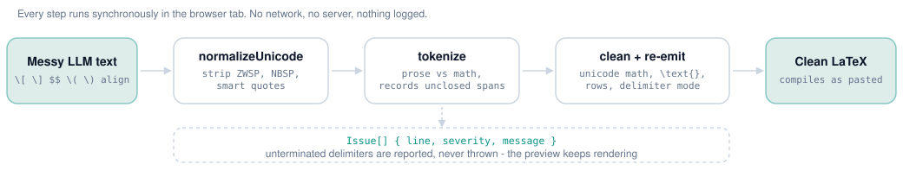

# The cleanup engine

All of it lives in [`src/lib/cleaner.ts`](../src/lib/cleaner.ts): one pure,
synchronous, dependency-free module. No DOM, no React, no I/O. That constraint is
what lets the same code run on every keystroke in the browser and under plain
node in CI.

```
normalizeUnicode  ->  tokenize  ->  per-block cleanup  ->  re-emit  ->  tidy
```

<picture>
  <source media="(prefers-color-scheme: dark)" srcset="../static/readme/pipeline-dark.svg">
  
</picture>

## 1. normalizeUnicode

Document-wide, before anything is parsed:

- CRLF and CR collapse to LF.
- Invisible codepoints are deleted: zero-width space / non-joiner / joiner, word
  joiner, BOM, soft hyphen, Mongolian vowel separator, Arabic letter mark, and
  the invisible math operators (`U+2061`-`U+2064`).
- Exotic spaces (NBSP, en/em spaces, ideographic space) become a plain space.
- Smart quotes and ellipses become their ASCII equivalents.

These are the characters that make a copy-pasted equation fail to compile with an
error message pointing at nothing visible.

## 2. tokenize

A hand-written scanner, not a regex chain. It walks the string once and emits
`text`, `inline` and `display` tokens. It recognises:

| Opener | Closer | Result |
| --- | --- | --- |
| `\[` | `\]` | display |
| `\(` | `\)` | inline |
| `$$` | `$$` | display |
| `$` | `$` | inline |
| `\begin{env}` | `\end{env}` | display, `env` recorded |

Why a scanner:

- **Escapes.** `\$5` is a price, not a delimiter. `\\]` is a row break followed by
  a bracket, not the end of a display block. A scanner that skips escape pairs
  gets these right; a regex alternation does not.
- **Nesting.** `\begin{align}` inside `\begin{align}` is matched by depth
  counting.
- **Code.** Fenced blocks and inline backticks pass through untouched, so a
  markdown answer that *documents* LaTeX is not rewritten.

### The safety net

An unterminated delimiter never throws and never swallows the rest of the
document. The opener degrades to literal text, an `Issue { line, severity,
message }` is recorded, and scanning continues. The UI paints that line red in
both the gutter and the editor body, and the preview keeps rendering everything
else - which is what you want while you are still typing.

One extra guard: a `$ ... $` span containing a blank line is treated as unclosed.
Without it, a single stray `$` would consume the remainder of the document.

## 3. Per-block cleanup

Applied to math payloads only, so prose keeps its own typography:

- **Unicode math to commands.** `<=` becomes `\leq`, Greek letters become
  `\alpha`, and so on - about 60 glyphs. The table is keyed by hex codepoint.
- **`\text{}` auto-escaping** (toggle). Prose inside math is wrapped so it
  typesets as words rather than a product of variables.

The `\text{}` pass is the one place where a bug silently changes the user's
mathematics, so it is deliberately conservative. LaTeX commands and existing
`\text{...}` bodies are masked behind `NUL` placeholders first, so a command name
is never mistaken for an English word. Then only two things are wrapped:

- A parenthesised group that is *all* letters, digits, spaces and light
  punctuation, **and** contains either Hangul or two consecutive words of 2+
  letters. `(some raw text here)` qualifies. `(y_i - f(x_i))^2`, `(a + b)` and
  `(n)` do not.
- A run of two or more consecutive plain words, or a run of Hangul.

A single symbol is never wrapped. Neither is anything containing an operator.
When in doubt the pass does nothing, because leaving `(n)` alone costs the user a
keystroke while wrapping `(a + b)` costs them a wrong equation.

## 4. Re-emission

`detectEnvWrapper` first checks whether a display block is *exactly* one
`\begin{...}...\end{...}`. If so the outer `$$` or `\[` is dropped. Nesting a
display delimiter around an `align` is the most common compile error in LLM
output, and it is the one fix most worth having.

Numbered environments are starred (`align` -> `align*`, `equation` ->
`equation*`), because a snippet pasted into the middle of a paper should not
silently renumber the author's own equations.

### Row repair (toggle)

Inside row-based environments:

- Every row but the last gets a `\\` terminator, unless it already ends in one,
  in an `&`, in an open brace, or in a structural command.
- In align-like environments only, a row with no `&` gets one inserted before its
  first top-level `=`. Depth counting keeps it out of `{...}` groups, and
  `<=`, `>=`, `!=`, `:=` and `==` are skipped. Rows whose relation is `\le` or
  `\ge` are left alone rather than guessed at.

### Delimiter modes

| Mode | Plain display block | Inline | Existing environment |
| --- | --- | --- | --- |
| Standard | `$$ ... $$` | `$ ... $` | kept bare, starred |
| Academic | `\begin{equation*}`, or `\begin{align*}` when the block has rows | `$ ... $` | kept bare, starred |
| Inline-only | collapsed to `$ ... $` | `$ ... $` | kept bare, starred |

Academic mode never wraps multi-row content in `equation*`, which holds exactly
one row - it promotes it to `align*` instead.

## 5. Tidy

Trailing whitespace is stripped per line, runs of 3+ blank lines collapse to one,
and the document is trimmed.

## Invariants

Two properties are enforced by [`tests/cleaner.spec.ts`](../tests/cleaner.spec.ts)
and must not be weakened:

1. **Idempotence.** `cleanMath(cleanMath(x)) === cleanMath(x)`. Clean output is a
   fixed point.
2. **Every output parses.** All bundled examples, in all three delimiter modes,
   are rendered through KaTeX with `throwOnError: true`.

## The preview path

`segment()` reuses the same tokenizer on the *cleaned* output, so the preview
shows what the clipboard will contain rather than a separate interpretation.

`prepareForKatex()` bridges the gap between amsmath and KaTeX's subset: it unwraps
`equation*` / `displaymath` (which KaTeX has no environment for), maps `multline`
to `gather*` and `flalign` / `eqnarray` / `alignat` to `align*`, and strips
`\label` and `\nonumber`. Without it a perfectly valid Overleaf snippet would
render as a red error box and read as a CleanMath bug.

A block KaTeX still cannot parse renders as an inline red chip with the parse
error in its tooltip, and the rest of the document keeps rendering.
